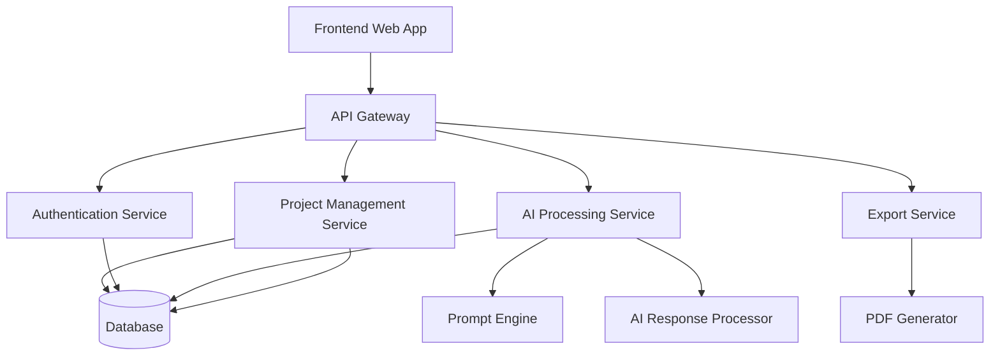

# Architecture Plan

## High-Level Architecture

---

# Architecture Components

## Frontend Web App
Responsible for:
- User interface
- Dashboard views
- Startup submission forms
- Project management

---

## API Gateway
Handles:
- Request routing
- Authentication validation
- API security
- Rate limiting

---

## Authentication Service
Responsible for:
- User registration
- Login
- Session management
- Access control

---

## AI Processing Service
Handles:
- Startup summary generation
- Competitor analysis
- MVP planning
- Pitch deck generation

---

## Project Management Service
Responsible for:
- Saving projects
- Loading drafts
- Project organization
- User project management

---

## Export Service
Handles:
- PDF export
- Markdown export
- Download generation

---

## Database
Stores:
- User accounts
- Startup projects
- AI-generated content
- Export history

---

# Technical Stack

## Frontend
- React
- Tailwind CSS

## Backend
- Python Flask API

## Database
- PostgreSQL

## AI Integration
- OpenAI API

---

# Security Considerations

- Password hashing
- JWT authentication
- User authorization checks
- Input validation

---

# Scalability Considerations

- Modular services
- Database indexing
- Async AI processing
- Export queue handling

---

# MVP Deployment Plan

## Initial Deployment
- Single cloud server
- PostgreSQL database
- Flask backend API
- React frontend

## Future Improvements
- Microservices migration
- Kubernetes deployment
- AI workload scaling
- Multi-user collaboration