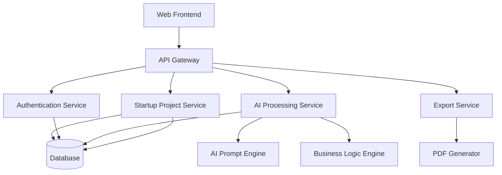

# System Architecture

---

# Architecture Components

## Web Frontend
Handles:
- User interaction
- Dashboard views
- Startup idea forms
- Project management

---

## API Gateway
Responsible for:
- Routing requests
- Authentication validation
- API security
- Request throttling

---

## Authentication Service
Handles:
- User registration
- Login
- Session management
- Access control

---

## AI Processing Service
Responsible for:
- Startup idea generation
- Pitch content generation
- Competitor analysis
- MVP planning

---

## Startup Project Service
Handles:
- Project storage
- Draft management
- Project retrieval
- User project organization

---

## Export Service
Responsible for:
- PDF export
- Markdown export
- Presentation formatting

---

## Database
Stores:
- User accounts
- Startup projects
- AI-generated content
- Saved drafts